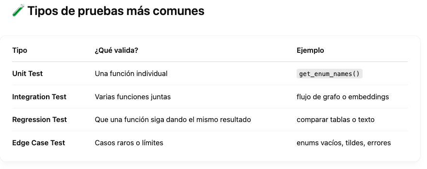

# Caracteristicas

en Python que te permite escribir y ejecutar pruebas de forma simple, legible y potente. Se usa para validar que tu código funcione correctamente ahora y en el futuro.

Para ejecutar por consola

- pytest
  
O más detalle (verbose):

- pytest -v
- pytest -v tests/test_explicaciones.py
  
Se puede agregar  -s para ver los prints ej.:

- pytest tests/test_generadores.py -s
- pytest -p no:warnings

  
## Buenas prácticas

Cada test es independiente.

Nombrar claramente el test: qué prueba y qué resultado espera.

Testea tanto lo esperado como lo erróneo (input mal formado).

Usa fixtures si necesitas preparar datos (más adelante).

